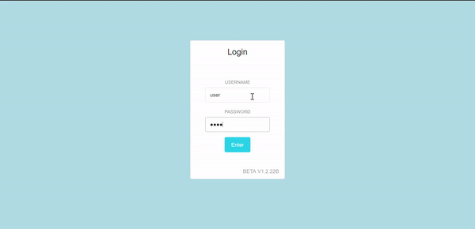

# Home System

A home system that *(to be honest with you)* only allows you to save and view recipe **FOR NOW**. 
This project is build with PEVN stack.



## Installation

Installation is very simple for someone who has programming knowledge. Follow the step by step installtion guide.

1. Use the package manager [npm](https://docs.npmjs.com/cli/install) to install the needed node_modules in **'./home_system/server** and **'./home_system/screen**.

```bash
npm install
```

2. Make sure your have installed [PM2](https://pm2.keymetrics.io/) process manager and [Sequelize-CLI](https://github.com/sequelize/cli) as global.

```bash
npm install pm2 -g
```
```bash
npm install --save-dev sequelize-cli
```

3. Part I: Setup [PostgreSQL](https://www.postgresql.org/) database. Create a database named **home_db**. To change the configuration for database migration, you can refer to **'.\home_system\server\config'** directory.
```bash
sequelize-cli db:migrate
```
4. Part II: Setup database. After migrating, find **INITIALIZE.sql** file in **'.\home_system\database'** directory and run the file in the database.

5. Delete _dist folder_ in **'.\home_system\screen'** and build the vue application.
```bash
npm run build
```

6. Replace the contains of the _dist folder_ into **'./home_system/server/public'**.

7. Open cmd in **'.\home_system\server'** and run.
```bash
npm start
```
8. Serve at **localhost:4874**.  _Rebuild vue application if you cannot connect to the backend (npm run build in **'./home_system/screen'** and change **.env.production** accordingly.)_

**Username:** user
/ **Password:** password

_If you are having any problem, you can contact me._

# Latest Updates

- Users will be redirected to login paged after session expires (15 minutes) or if users directly access page without logging in.
- Deleting a recipe will also delete the picture that was uploaded with it (I can't believe I did not put this earlier - talk about storage space).
- Database config can now be updated at **'.\home_system\server\config\config.json'** instead of all over the code.
- 

# A brief story (Just skip if you are too lazy to read)
This project is started so I can learn more about web programming and mainly to improve my front-end skill (cause my imagination sucks). For this project I used PEVN stack which is PostgreSQL as database, Express Js as backend and Vue Js as the frontend. 

## Database
I chose PostgreSQL because it is open source, it is a relational database and also has support for JSON data. I also can use PostgreSQL to create complex functions (stored procedures) that can easily be called from the server. I have made a few functions that can be viewed in **'./home_system/database**. For this project, I created a function F_RECIPE_ADD, F_RECIPE_DELETE, F_RECIPE_SEARCH, F_RECIPE_UPDATE which will be called with the help of [Sequelize ORM](https://sequelize.org/) in the backend.

## Front-end
I'm not a front-end kinda person so for this project I relied heavily on a template (credit to the author below). Even with a template, one would still need to understand the basics of HTML, JS, CSS. With Vue Js, there are different syntax that can be helpful during development. You can see some [here](https://vuejs.org/v2/guide/syntax.html). When writing the code for the front-end, I had to test many different codes to find the best one. In other words, my front-end code looks like frankenstein. It is vomit-inducing. There are parts that still needs work as it is mostly hard-coded. 

## Back-end
Back-end is the place where I can have fun. For this part, I used [Passport Js](http://www.passportjs.org/) for authentication, [Sequelize ORM](https://sequelize.org/) to connect to the database and call my functions. For a simple project as this there is not much to the backend coding (I want to practice more on front-end and I already have a job for back-end stuff).

# Working with the code

There is not much to the code in retrospect but I will explain some part that I think needs some explanation if you decide to play around with the code.

### Back-end code
```bash
./home_system/server
```
This is the temple of the server. Run **npm start** in here to trigger **pm2 start ecosystem.config.js --env production** command. This will start the server in production mode. I believe the code for the backend is straight foward so there won't be much explanation.

```bash
./home_system/server/public
```
When I build the front-end Vue code, I place the files into this directory. The back-end will handle this folder as static onto the browser.

The basic flow of the backend goes from **./server/bin/www** -> **'./server/app.js'** -> **'./server/routes/*.js** -> **'./server/controller/*.js'**. 
The controller is where all the manipulation of data happens.


### Front-end code

```bash
npm run dev
npm run serve
```
The command above will run Vue server on **localhost:8080**
```bash
npm run build
```
The command above will build the vue application
```bash
./home_system/screen/.env.development
./home_system/screen/.env.production
```
This file is for you to set ENV variable values for the application. You can read more [here](https://cli.vuejs.org/guide/mode-and-env.html).
If you want to change the connection to the backend, you can do so in the files above under VUE_APP_API_URL_. Take note that during building, vue will take values from the production file.

### Explanation on the system

First you will be greeted with a log in page. Once you log in, you will see the homepage. A cookie will set for 15 minutes to save the session. If you enter the log in page and still have the session active, it will redirect you to the homepage. In the homepage there are steps about saving, searching, viewing and deleting a recipe so I won't explain it here. All in all, I believe everything is very straight foward.

# Things to improve on

- [ ] Add and delete users
- [ ] User profile page
- [ ] Logs
- [X] Mobile-ready
- [ ] Less hard-code
- [ ] Add recipe data entry page (Mobile)
- [ ] More dynamic code

# Credits
- VueJs Template : [Light Bootstrap Dashboard](https://www.creative-tim.com/product/vue-light-bootstrap-dashboard)
- StackOverflow: [StackOverflow](https://stackoverflow.com/)
- Massive Online Documentation: [Google](www.google.com)

# Other projects

- [autosettergetterjs](https://github.com/nivleM-ed/autosettergetterjs) - It's available on VSCode (Search for nivlem.autosettergetterjs)

# Contact 
Email - melvinedward98@gmail.com

Phone - [999](seriouslydontcallthisnumber)

